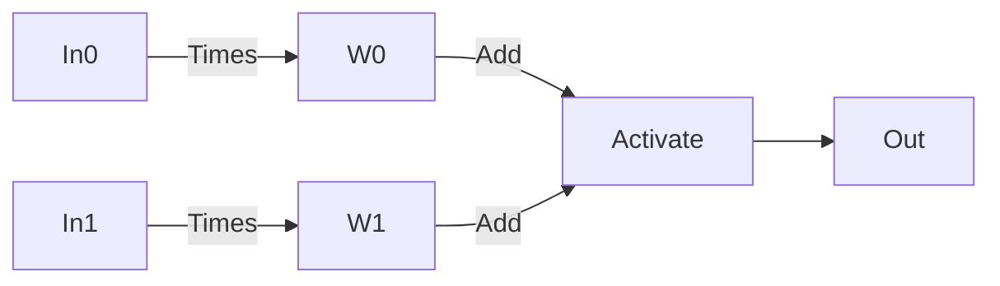

# Binary Neural Networks
C. Wass, 2024, All Rights Reserved.


### Introduction

When artificial neural networks (ANNs) are mentioned, thoughts immediately go to the largest and most famous models such as ChatGPT and Dall-E.  These systems are extraordinary in what they can do, but they also have some potentially significant issues with cost, computational requirements. training data sources, etc.  This work introduces an alternative approach to ANNs that does not replace the current generation of systems but provides a complimentary avenue of research and perspective.

To provide context for the work that follows, a short discussion of what machine learning (ML) is and how this work is different is required.  ML is commonly accepted as a statistical process performed on data to generate useful models.  This can include systems such as support vector machines or clustering models.  ANNs go another step and introduce a conceptual framework notionally related to a biological systems of neurons, with a combination of linear algebra and an activation function representing a virtual neuron (simply referred to as a neuron hereafter).  That is, using linear algebra and an activation function, a model can be created that naively follows the basic process of a biological neuron: weighted inputs that collectively determine if the neuron triggers or not.

Visually, the basic virtual neuron is:



In order to actually create the model contained by the ANN, a training process is used.  A basic summary of the process is that an input is presented to the ANN generating an output which is then compared to the desired output using an error function and any required correction is applied to the model through the weights.  The training process can be quite complex and contain a number of different conceptual elements, but the correction as determined by the error function propagates back through the model somehow in all cases.  This is the portion of the process that requires the most significant amount of computation and this load is exacerbated by the significant quantities of data that must be processed to get a viable model.

The development of binary neural networks (BNNs) requires 2 changes to the this approach.  The first is to change the activation function.  General ANNs (as done currently) use a continuous, differentiable, function such as the sigmoid, permitting the corrections as determined by the error function to be correctly propagated back to the weights.  The BNNs developed here use a simple step function for activation, written in C++[^1] as: 

` input > 0.5 ? output = 1.0 : output = 0.0;`

[^1]: All code is in C++ using the Eigen3 header only math library, see associated code for additional details

That is, if the input is greater than 0.5 return 1 (activated) otherwise return 0 (not activated).  The choice of inflection point (that is the input value that changes the activation function output from 0 to 1) is done with consideration for ease of understanding and simple use.  It is important to note here that changing the inflection point of the activation function might also require changing the weights matrices used in a way that is not seen with other systems.  This approach immediately raises the question of how to set the weights, as back-propogation is no longer a valid operation.  Which brings up the second change from traditional ANNs, that the weights for this system will have to be developed analytically and supplied prior to use of the BNN.  

That change, that the implemented model is supplied rather than derived statistically or through some other calculation, is also why this framework should not be thought of as a type of machine learning.  It is instead a method of programming ANNs as a replacement for training them.

### Development Detail

In order to develop a way forward, that is to understand what analytic options other than regression might be available to build a weights matrix for our ANNs, it seems best to start with the simplest possible thing to build: an analog of an OR-gate as understood in a digital logic circuit.  It will need to have 2 inputs, 1 output and conform to the structure of an ANN as given in the introduction.  For development purposes, the inputs will be constrained to binary values, 1 or 0, and though this is not actually a requirement, it reduces complexity.  The truth table for this is:

```
X	  Y	  Out
0	  0	  0
1	  0	  1
0	  1	  1
1	  1	  1
```

It doesn't take long thought to recognize that we can do this with a weights matrix of:

W0:

`1.0	 1.0`

If we assume our input vector, with 2 (x and y) elements is I, then the result of (W0 *  I ) put through the activation function given previously results in an output of 1 if either value in I is a 1, 0 otherwise.  An example of the code that might implement this, returning 0 or 1 according to the given truth table would be:

```
float BNN::SimpleLogicGate(float a, float b)  {
	Eigen::Vector2f u;
	float result, tmp1;
	u << a, b;
	tmp1 = W0 * u;
	result = activate(tmp1);
	return result;
}
```
 This immediately points to the next step, building an analog to an AND-gate.  The truth table is:
```
X	Y	Out
0	0	0
1	0	0
0	1	0
1	1	1
```

The weights matrix W1, 

W1:

`0.5,0.5`

multiplied by the input vector I then put through the activation function will generate output that matches the given truth table.  The code to implement this is identical to that given previously for the SimpleLogicGate function.

This is a promising beginning, but with only the two basic logic gates modelled, the capabilities of this system are extremely limited.  A more complicated truth table, such as an XOR-gate,
```
X	Y	Out
0	0	0
1	0	1
0	1	1
1	1	0
```

will perhaps provide additional insight into developing useful weights matrices for BNNs.  It's well established this can be easily done using regression techniques as this is a common starting point for developers learning ANNs.  Using that previous work as a guide, it can be seen that there will need to be at least 2 layers in a BNN that models this truth table.  It is also known from general Boolean algebra that an XOR-gate is a combination of OR-gates and NOT AND-gates; specifically the truth table demonstrates OR with NOT-AND for the inputs.  Conceptually, using each of the neurons to represent a logic gate, the input will need 2 of them to test for OR and AND followed by a second layer to resolve to the final answer.  The first stage of a BNN that can implement this will have 2 input neurons with the following weights matrix:

W2
```
1.0	1.0
0.5	0.5
```
The result of multiplying this matrix by the input vector, I, is a 2 element vector.  The first element in our interim result vector represents the results of an OR-gate test on the 2 input values, the second is the result of an AND-gate test, each after activation.  The output from this set of neurons can then be handled by a single neuron with the weights matrix:

W3

`1.0, -1.0`


The -1.0 weight represents inverting, or negating, the AND-gate test output in the vector's second row resulting in the desired output.  An example of code that performs the XOR capability is:
```
 float BNN::XORGate(float a, float b)  {
	Eigen::Vector2f u; 
	Eigen::Matrix<float, 2, 1> tmp1;
	Eigen::Matrix<float, 2, 1> tmp2;
	float tempResult, result;
	 
	u << a,b;	
	tmp1 = W2 * u;
	// activation, unwind the iterator loop because that makes sense here
	tmp2(0,0) = activate(tmp1(0,0));
	tmp2(1,0) = activate(tmp1(1,0));
	tempResult = W3 * tmp2;
	result = activate(tempResult); 
	
	return result;
 }
```
This brings the concept of BNNs to an interesting point.  Given the preceding, it is now apparent BNNs 
can be used to model any system that can be modelled by a system of logic gates.  Each of the elements demonstrated can be considered a discrete thing, used in conjunction with whatever other elements may be required to build more complex systems.  

There are, though, additional considerations for how such composite systems might be developed.  Understanding the XOR-gate as implementing a comparison (output 1 if they are different, 0 otherwise), we can examine what this would look like if we extended the comparison to 4 element vectors.

The way presented here consists of appending one vector to the other followed by comparing corresponding positions.  The basic idea is to have 1 neuron do an equivalent OR for each pair ignoring all other inputs and another for the matching AND operation.  A weights matrix that can be used to accomplish this, with the first row representing a neuron for the OR portion of comparing the first position of each of the input vectors, the second row is a neuron doing the AND equivalent on the same elements, then continuing pair-wise, would be:

W4: 
```
1.0, 0.0, 0.0, 0.0, 1.0, 0.0, 0.0, 0.0,
0.5, 0.0, 0.0, 0.0, 0.5, 0.0, 0.0, 0.0,
0.0, 1.0, 0.0, 0.0, 0.0, 1.0, 0.0, 0.0,
0.0, 0.5, 0.0, 0.0, 0.0, 0.5, 0.0, 0.0,
0.0, 0.0, 1.0, 0.0, 0.0, 0.0, 1.0, 0.0,
0.0, 0.0, 0.5, 0.0, 0.0, 0.0, 0.5, 0.0,
0.0, 0.0, 0.0, 1.0, 0.0, 0.0, 0.0, 1.0,
0.0, 0.0, 0.0, 0.5, 0.0, 0.0, 0.0, 0.5;
```
And the second required matrix simply needs to combine the OR output with the appropriate NOT-AND:

W5:

`1.0, -1.0, 1.0, -1.0, 1.0, -1.0, 1.0, -1.0;`

The code that implements the system to compare 2 4-element vectors is:

```
float BNN::compareVectors(Eigen::Matrix<float, 4, 1> leftVec, Eigen::Matrix<float, 4, 1> rightVec)  {
	Eigen::VectorXf testVec(8);
	Eigen::VectorXf tmpVec(8);
	Eigen::VectorXf intVec(8);
	testVec << leftVec, rightVec;
	intVec = W4 * testVec;
	for (int i = 0; i < 8; i++) {
		tmpVec(i, 0) = activate(intVec(i, 0));
	}
	interimResult = W5 * tmpVec;
	result = activate(interimResult);
	
	return result;
}
```

This function returns a 0 if the vectors are the same and a 1 otherwise.

This illustrates that, at least in some cases, there is a very clear and logical connection between the weights matrix used and the truth table it implements.  Each neuron can be viewed as a simple  logic element and to the extent the logic elements are performing unrelated operations they can be collectively modelled using a single weights matrix.  This a approach to parallelism dovetails very nicely with distributing the processing load across multiple small, specialized floating-point processors such as GPUs.

There are other operations available that will help inform the development of BNNs.  A more challenging operation that might be demonstrated is binary addition, and given the preceding it is clearly possible.  In this case, the model will perform binary addition on 2 4 element input vectors (in other words, a 4-bit binary adder).   It will exhibit the following characteristics:

1. output will include an overflow flag,
2. for encoding, the most significant digit is at the start of the output vector, that is it is big endian.

The weights matrices needed are already built, which indicates the composition approach is useful at least initially.  The system implemented is based on a very basic 4 bit adder with carry, and is not described in detail here.  The code to implement a 4 bit adder is:

```
Eigen::Matrix<float, 5, 1> BNN::4BitAdder(Eigen::Matrix<float, 4, 1> leftVec,  Eigen::Matrix<float, 4, 1> rightVec)  {
	
	//Implements a simple 4-bit binary adder, return vector includes overflow
	Eigen::Matrix<float, 5, 1> localRet(0.0, 0.0, 0.0, 0.0, 0.0);
	Eigen::VectorXf testVec(8);
	Eigen::VectorXf tmpVec(8);
	Eigen::VectorXf intVec(8);
	Eigen::Vector4f lvl2Vec;
	Eigen::Matrix<float, 5, 1> carry(0.0, 0.0, 0.0, 0.0, 0.0);
	Eigen::Vector2f int2Vec;
	float c1, c2;
 
	//Start with a collective XOR because that is also an add without carry
	testVec << leftVec, rightVec;
	intVec = W4 * testVec;
	for (int i = 0; i < 8; i++)  {
		tmpVec(i, 0) = activate(intVec(i, 0));
	}
	// do the pair-wise NOT-ANDs, 
	int k = 0;
	for (int j = 0; j < 8; j+=2)  {
		int2Vec = tmpVec.block<2, 1>(j, 0);
		lvl2Vec(k, 0) = activate(W3 * int2Vec);
		k++;
	}
	
	// Now add the carry and determine subsequent carry for each bit of the sum, have to go 	backwards because LSD is at the back	
	for (int m = 3; m >= 0; m--)  {
		localRet(m+1) = XORGate(lvl2Vec(m, 0), carry(m+1, 0));	 / / start with XOR
		c1 = activate((lvl2Vec(m, 0) * 0.5) + (carry(m+1, 0) * 0.5)); //a simple AND
		c2 = activate((leftVec(m, 0) * 0.5) + (rightVec(m, 0) * 0.5));	
		carry(m, 0) = activate(c1 + c2);	//compactify a simple OR 
	}
	// The leftmost position in the carry vector is the overflow
	localRet(0) = carry(0);
	return localRet; 	
}
```
See the associated code for details of the output and testing.

There is one final system to be explored in this work to demonstrate some additional capabilities of BNNs as well as important characteristics.  The ability to use an input to generate a defined output, that is to select distinct outputs in a deterministic way is expected to be useful.  This is just one example of a method using these techniques to perform a lookup, there are many other approaches that could be used.

The first part of a function to do this lookup will be straight forward.  It's simply a matter of comparing the input vector to a series of predetermined vectors, with the result of each comparison (a 1 or 0) being inserted into a corresponding vector with positional significance.  Assuming, for example, 16 potential values to be compared (two 4 element vectors), that would have a 16 element result vector, with the matched position being a 1, all others being 0.  The vector is then used against for the actual lookup matrix, providing a 4 element vector as output, for example:

lookup4Vectors

```
0.0, 0.0, 0.0, 0.0, 0.0, 0.0, 0.0, 0.0, 1.0, 1.0, 1.0, 1.0, 1.0, 1.0, 1.0, 1.0,
0.0, 0.0, 0.0, 0.0, 1.0, 1.0, 1.0, 1.0, 0.0, 0.0, 0.0, 0.0, 1.0, 1.0, 1.0, 1.0,
0.0, 0.0, 1.0, 1.0, 0.0, 0.0, 1.0, 1.0, 0.0, 0.0, 1.0, 1.0, 0.0, 0.0, 1.0, 1.0,
0.0, 1.0, 0.0, 1.0, 0.0, 1.0, 0.0, 1.0, 0.0, 1.0, 0.0, 1.0, 0.0, 1.0, 0.0, 1.0;
```

The associated code iterates through each element of the lookup vector writing the inverted result of our comparison (as defined earlier) to the selection vector at each position.
```
Eigen::Matrix<float, 4, 1> BNN::lookup4Vector(Eigen::Matrix<float, 4, 1> findVec)  {
	
	Eigen::Matrix<float, 4, 1> retVal;
	Eigen::Matrix<float, 16, 1> indexUnwound;
	
	for (int i = 0; i < 16; i++)  {
		indexUnwound[i] = invertF(compare4Vectors(index4[i], findVec));
	}
	retVal = lookup4Vectors * indexUnwound;
	
	// At this point, the output value matches what's in the lookup matrix, it can be any value 	you want there and need not be activated if that makes sense
	return retVal;
```

Inverting the comparison result at each point is done using a convenience function, though if it seems necesary, doing an XOR against a 1 provides the same result.  In any event, the resulting comparison vector will simply select the values in the column that corresponds to the row with a 1.  For the purposes of this work, the output matrix only has 1s and 0s, but that is not a requirement.  This structure could, for example, be used as part of a system translating an output to some symbol table that isn't explicitly binary.

### Future Directions

The work presented outlines a fundamentally different approach from existing neural network architectures, driven by the replacement of training through back-propogation with an analytic approach to develop the weights matrices.  The main focus and primary reason for sharing this work is that it opens artificial neural network research to a much wider audience and removes some significant barriers to entry that exist in other approaches.  All that is required to build robust, complex logic systems using artificial neural networks is a basic understanding of programming, logic and linear algebra and how they come together in BNNs.

Given the preceding discussion, it is clear any system that can be designed using logic gates can be done as a feed-forward BNN.  Importantly, this allows for quickly and easily iterating complex logic systems fully in software that can then either be directly deployed or transitioned to physical hardware.  Even small microcontrollers such as Arduino can easily handle the equivalent of thousands of virtual logic elements, a more capable system such as a RaspberryPi can do significantly more.  This seems to be a very solid base for developing control systems in a way that's as predictable and controllable as hardware but with the ease, low cost and rapid development of software.  Current research indicates unexpectedly complex capabilities can be realised with very small amounts of space and processing.

Extending this work further, there is a possibility to revisit how modern operating systems function.  Current microprocessors are complex and power-hungry devices containing all the logic and associated structures necessary to implement a full instruction set.  That instruction set is made available through and activity is mediated by the overlaying operating system.  Adding additional CPUs, that is cores on the same die, is difficult, expensive and current technology is getting close to the physical limits of how small we can make functional features on these chips.  The approach described here allows for a significant portion of the operating system's activity to be moved from these CPUs to highly optimized GPU processors doing straight-forward floating point math operations (with potential impact to Moore's Law).  These are smaller, much less expensive and can be aggregated more easily.  The approach presented here also lends itself to parallelism, as was demonstrated, for example, in the method to compare 4 element vectors.  The degree to which this approach represents improvement is yet to be determined.   Logic elements implemented in software will operate more slowly than those in hardware, but the improvements in parallellism and optimized processing have a reasonable chance at making up more than the difference in non-trivial applications.  This approach also allows extending the usefulness of optimizations currently being developed for ANNs into areas that are not otherwise approachable with a traditional, regression based, neural network.

The basic demonstration of composability suggests there will likely be only a small number of weights matrices needed to achieve most expected requirements, each representing a distinct type of logic operation.  This implies that, although the size of the weights matrices scales aggressively in space with the size of the vectors being used, there is a limited number required and there is no apparent direct link between the number of weights matrices and the number of vector elements needed for the processing intent.  There are further optimizations available in that, for example, there are many points where the activation function has no effect and can be skipped.

Finally, BNNs are also very easy to integrate with models developed by regression, providing a significant amount of flexibility in solving complex problems.  A model can implement features of both types of models, more or less seamlessly and using the same optimized tool sets.  Conceptually, the neurons are being distinguished by the activation function they use, so there doesn't seem to even be a need for an abstraction layer at the interconnect points in that architecture.  The BNN elements in a system can be thought of as static processing elements and can simply be ignored during back-propogation training.  Feed-forward should be able to use both regression-based ANNs and BNNs without distinction, as long as due regard to the activation function is maintained.

There is no obvious reason activation functions other than those given can't be used.  Work in this area so far has not demonstrated a need, or additional benefits, but even a very simple model neural network can easily accomodate multiple different types of virtual neurons, with the activation function being the defining feature for each type of neuron.  There's every reason to expect we will find uses for additional types of activation functions in the future.  Additional types of virtual neurons will also bring additional complexity and it is too early to know how this will balance out.

